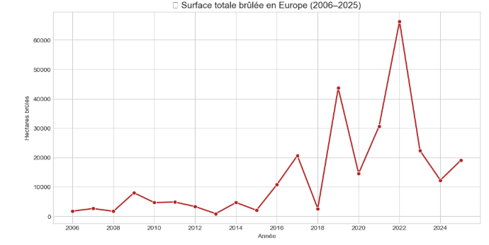
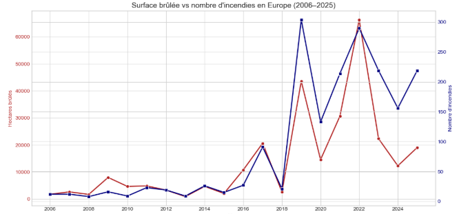
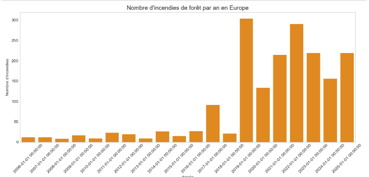

# 🗺️ Sommaire

- [📁 Données utilisées](#-données-utilisées)
- [🎯 Objectifs](#-objectifs)
- [🛠️ Technologies utilisées](#-technologies-utilisées)
- [📊 Principales visualisations](#-principales-visualisations)
- [📈 Résultats clés](#-résultats-clés)
- [👩‍💻 Réalisé par](Tatiana SANGUEAL NAHAM)
- 🔗 ([https://www.linkedin.com/in/ton-lien-linkedin](https://www.linkedin.com/in/tatiana-sangu%C3%A9al-naham-050170178/))

# Analyse-incendies en Europe
Analyse des données d'incendies en Europe (2006-2025) avec Python — Visualisation, modélisation et interprétation.

Ce projet explore les incendies forestiers en Europe entre 2006 et 2025, en mettant en lumière l'évolution de la surface brûlée, le nombre d'incendies et leur corrélation.  
Il utilise des données réelles et propose des visualisations interactives pour dégager des tendances.
#   📁 Données utilisées

- Source : [EFFIS – European Forest Fire Information System](https://effis.jrc.ec.europa.eu/)
- Données annuelles de 2006 à 2025
- Colonnes : `Year`, `BurnedArea` (en hectares), `"NumberOfFires` (nombre d'incendies)
# 🎯 Objectifs

- Étudier l’évolution des incendies en Europe entre 2006 et 2025
- Visualiser la surface totale brûlée et le nombre d’incendies
- Analyser les ratios récents (2021–2025) d'incendies par surface
- Interpréter les anomalies : baisse en 2022, hausse en 2024/2025
- Identifier les liens entre fréquence et intensité des feux
  
# 🛠️ Technologies utilisées

- `Python`
- `Pandas`, `Matplotlib`, `Seaborn`
- Optionnel : `Scikit-learn` pour régression simple
- 📘 [Voir le notebook Jupyter](./Analyse incendies en europe (2006-2025).ipynb)

 # 📊 Principales visualisations

- **Courbe de la surface brûlée par an**  
- **Barplot du nombre d’incendies**
- **Corrélation entre feux et hectares brûlés**
- **Indicateur d’intensité : Feux pour 1 000 ha

 #🔥 Surface totale brûlée en Europe (2006–2025)
Cette visualisation montre l’évolution annuelle des surfaces brûlées sur le continent, avec un pic remarquable en 2022, une accalmie en 2024 et une reprise en 2025.

#🔄 Corrélation entre le nombre d’incendies et la surface brûlée (2006–2025)
Ce graphique bivarié montre une tendance conjointe à la hausse du nombre d'incendies et de la surface brûlée depuis 2017, avec un pic marqué en 2022 et une reprise en 2025.

# 📊 Nombre d’incendies de forêt par an en Europe (2006–2025)
Ce barplot met en évidence une augmentation nette du nombre d’incendies à partir de 2017, avec un pic remarquable en 2018–2019. Cette tendance persistante reflète une pression croissante sur les écosystèmes forestiers européens.

# 🚀 Résultats clés

- 📉 **2022** : Faible nombre d’incendies mais grande surface brûlée  
  → Incendies probablement plus vastes et moins maîtrisés

- 📈 **2024 & 2025** : Hausse du nombre d’incendies pour une surface globalement stable  
  → Feux plus fréquents mais peut-être mieux contenus

- ⚖️ **2021** : Ratio stable (~7 incendies pour 1 000 ha)  
  → Sert de référence pour les comparaisons

- 🔁 Corrélation modérée entre **nombre de feux** et **surface brûlée**  
  → Plus d’incendies ne signifie pas toujours plus de surface touchée

- 📊 **Modélisation par régression linéaire** :
  - Mise en évidence d’une tendance linéaire dans l’évolution des surfaces brûlées
  - **🔥 Prédiction surface brûlée en 2025 : 30 158 hectares*
