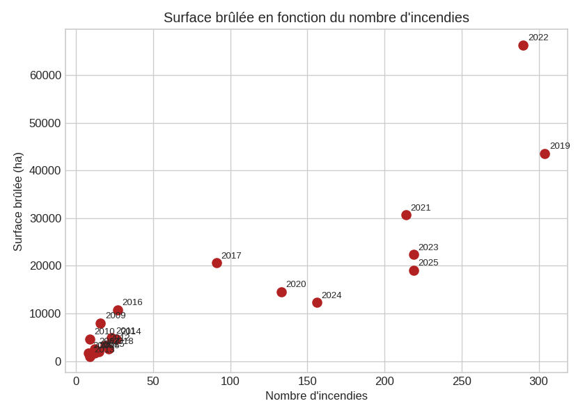
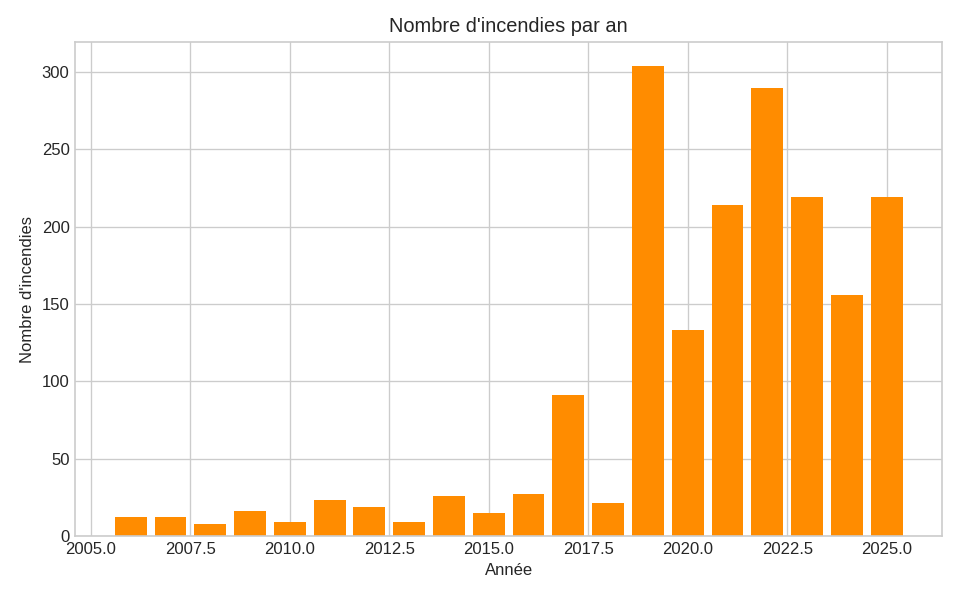
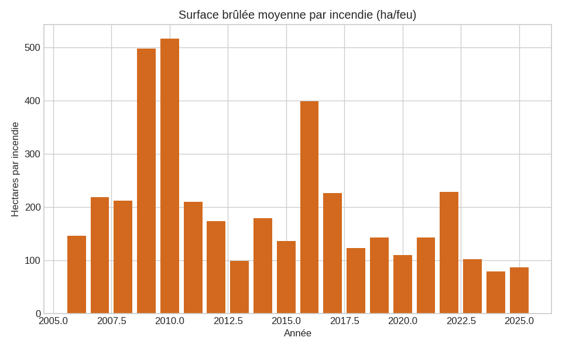
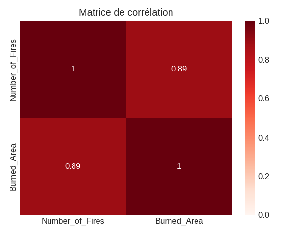
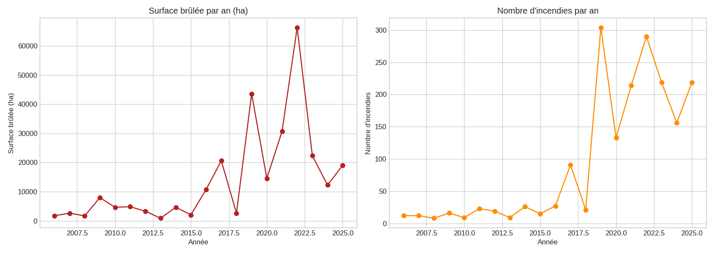
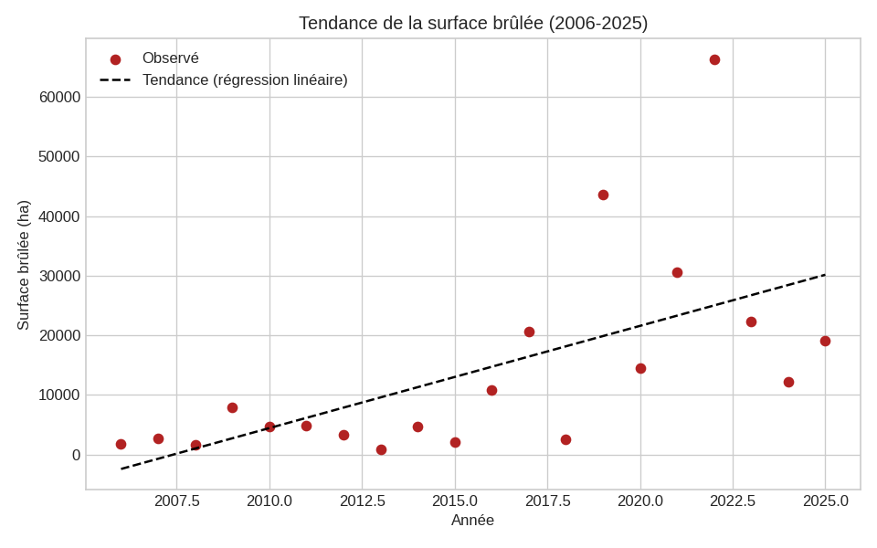

# 🗺️ Sommaire

- [📁 Données utilisées](#-données-utilisées)
- [🎯 Objectifs](#-objectifs)
- [🛠️ Technologies utilisées](#-technologies-utilisées)
- [📊 Principales visualisations](#-principales-visualisations)
- [📈 Résultats clés](#-résultats-clés)
- [🧾 Conclusion](#-conclusion)
- [👩‍💻 Réalisé par](Tatiana SANGUEAL NAHAM)
- 🔗 ([https://www.linkedin.com/in/ton-lien-linkedin](https://www.linkedin.com/in/tatiana-sangu%C3%A9al-naham-050170178/))

# Analyse-incendies en Europe
Analyse des données d'incendies en Europe (2006-2025) avec Python — Visualisation, modélisation et interprétation.

Ce projet explore les incendies forestiers en Europe entre 2006 et 2025, en mettant en lumière l'évolution de la surface brûlée, le nombre d'incendies et leur corrélation.  
Il utilise des données réelles et propose des visualisations interactives pour dégager des tendances.
#   📁 Données utilisées

- Source : [EFFIS – European Forest Fire Information System](https://effis.jrc.ec.europa.eu/)
- Données annuelles de 2006 à 2025
- Colonnes : `Year`, `BurnedArea` (en hectares), `"NumberOfFires` (nombre d'incendies)
# 🎯 Objectifs

- Nettoyer et structurer les données brutes
- Visualiser l'évolution de la surface brûlée et du nombre d'incendies
- Mesurer la corrélation entre nombre d'incendies et surface brûlée
- Modéliser la tendance par régression linéaire
- Interpréter les résultats et identifier des pistes d'approfondissement
  
# 🛠️ Technologies utilisées

- `Python`
-  Pandas, Matplotlib, Seaborn, Scikit-learn, SciPy
- [📘 Voir le notebook Jupyter](./Analyse%20incendies%20en%20europe%20%282006-2025%29%20%282%29.ipynb)

 # 📊 Principales visualisations

 # 🔥 Surface totale brûlée en Europe (2006–2025)

Ce graphique bivarié montre une tendance conjointe à la hausse du nombre d'incendies et de la surface brûlée depuis 2017, avec un pic marqué en 2022 et une reprise en 2025.

# 📊 Nombre d’incendies de forêt par an en Europe (2006–2025)
Ce barplot met en évidence une augmentation nette du nombre d’incendies à partir de 2017, avec un pic remarquable en 2018–2019. Cette tendance persistante reflète une pression croissante sur les écosystèmes forestiers européens.

# ⚖️ Nombre d’incendies pour 1 000 hectares brûlés (2006–2025)
Cet indicateur met en lumière l’intensité moyenne des feux : des valeurs élevées indiquent de nombreux incendies de petite taille, tandis que des valeurs basses traduisent peu de feux mais très étendus. On observe une grande variabilité, avec un creux notable en 2022 (feux rares mais destructeurs) et des pics en 2013, 2018 et 2024.

# 🔗 Corrélation entre nombre d’incendies et surface brûlée (2006–2025)
Ce graphique illustre la relation entre la fréquence des incendies et leur impact total. Une hausse du nombre de feux tend à s’accompagner d’une surface brûlée plus importante. Néanmoins, cette corrélation n’est pas systématique : certaines années, peu d’incendies peuvent causer des dégâts très étendus (comme en 2022), tandis que d’autres années à forte fréquence présentent un impact plus modéré.

# 📈 Évolution de la surface brûlée en Europe (2006–2025)
Ce graphique présente les valeurs observées de la surface brûlée par an, accompagnées d'une droite de régression linéaire. Il met en évidence une tendance croissante inquiétante, suggérant que les incendies pourraient devenir un phénomène durablement installé sur le continent.

# 🚀 Résultats clés

- 📉 **2022** : Faible nombre d’incendies mais grande surface brûlée  
  → Incendies probablement plus vastes et moins maîtrisés

- 📈 **2024 & 2025** : Hausse du nombre d’incendies pour une surface globalement stable  
  → Feux plus fréquents mais peut-être mieux contenus

- ⚖️ **2021** : Ratio stable (~7 incendies pour 1 000 ha)  
  → Sert de référence pour les comparaisons

- 🔁 Corrélation modérée entre **nombre de feux** et **surface brûlée**  
  → Plus d’incendies ne signifie pas toujours plus de surface touchée

- 📊 **Modélisation par régression linéaire** :
  - Mise en évidence d’une tendance linéaire dans l’évolution des surfaces brûlées
  - **🔥 Prédiction surface brûlée en 2025 : 30 158 hectares*

# 🎨 Galerie des visualisations

|  |  |  |
|:--:|:--:|:--:|
| Surface brûlée | Corrélation temporelle | Fréquence annuelle |

|  |  |  |
|:--:|:--:|:--:|
| Feux / 1000 ha | Nb feux vs surface totale | Tendance linéaire (2006–2025) |

# 🧠 À retenir

- La surface brûlée augmente de manière préoccupante entre 2006 et 2025, avec un pic alarmant en 2022.
- Depuis 2017, les incendies sont non seulement plus fréquents, mais parfois plus destructeurs.
- Le ratio feux / 1 000 ha révèle une intensité très variable d’année en année.
- La corrélation entre nombre de feux et surface brûlée est réelle, mais loin d’être systématique.
- La tendance linéaire projetée laisse entrevoir une aggravation si aucune mesure n’est prise.

# 🧾 Conclusion
Cette étude souligne une mutation significative du panorama des incendies en Europe pour la période 2006-2025.  Les feux de forêt s'accroissent en nombre, en intensité et en superficie, soulevant d'importants défis tant environnementaux que politiques.

 L'examen conjoint de la fréquence, de l'étendue des incendies et des indices d'intensité met en évidence une tendance structurelle ascendante, soutenue par les prévisions linéaires.  Ces résultats devraient inciter à intensifier les politiques préventives, à ajuster les tactiques de combat contre les incendies et à prendre en compte plus largement le défi climatique dans la gestion des forêts en Europe.

🧑‍💻 *Projet réalisé par Tatiana SANGUEAL NAHAM*  
🔗 [LinkedIn]([https://www.linkedin.com/in/ton-lien-linkedin](https://www.linkedin.com/in/tatiana-sangu%C3%A9al-naham-050170178/))

